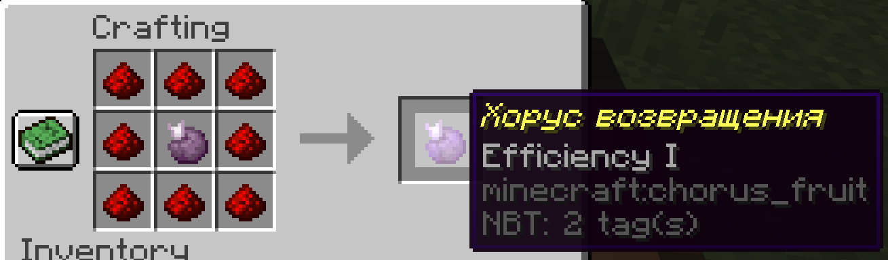
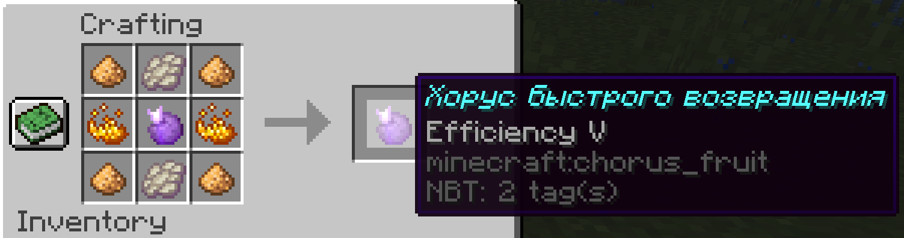
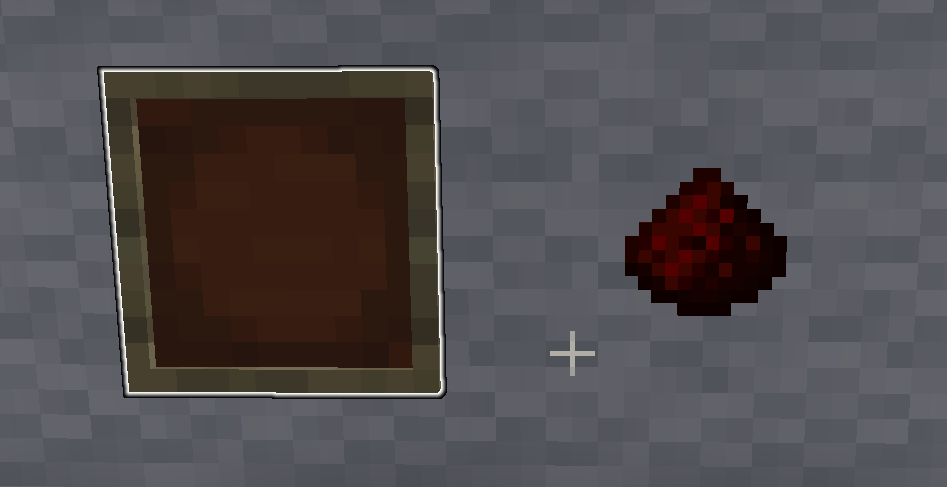
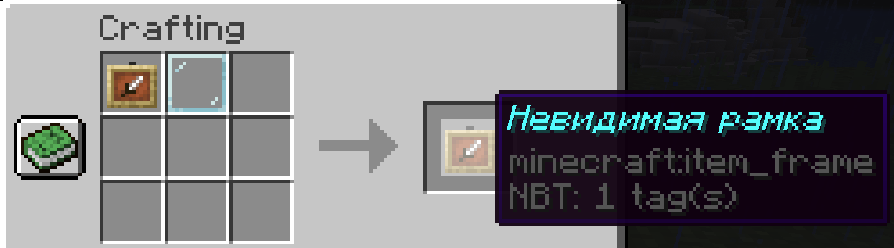
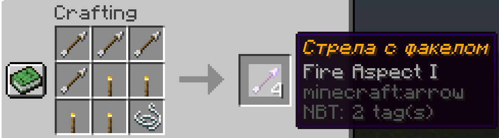
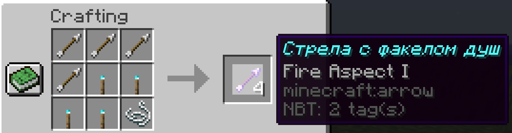
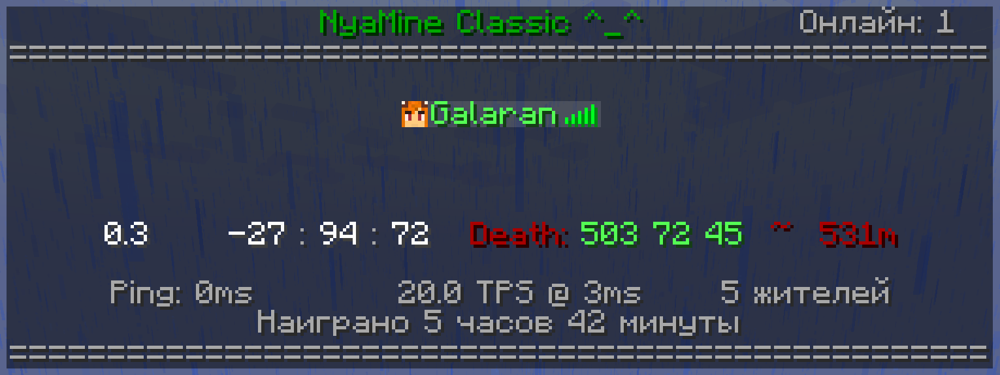

# NyaMineFeatures - sweet features for NyaMine Minecraft server

## Overview
Paper plugin for NyaMine Minecraft server, providing small gameplay/admin features, unrelated to each other.
It includes custom recipies, automatically unlocked to every player.

Dependencies:
* [Kotlin](https://github.com/galaran/KotlinMC)
* EssentialsX
* (Optional) [PrometheusExporter](https://github.com/sladkoff/minecraft-prometheus-exporter)

## Gameplay features

### Return chorus
Special kinds of churus fruit, acts like EssentialsX's `/home`, with various delay before teleport,
depends on grade. Delay progress displayed as boss bar.

#### Grade 1: 12 seconds delay

#### Grade 5: 3.5 seconds delay
**In the center: Grade 1 return chorus from previous recipe**

#### Grade 10: no delay - instant teleport after eat animation
Obtained by command only.

`/chorus <1|5|10>` - Gives you return chorus. Permission: `nyamine.chorus` (default to OPs only)

### Transparent item frame
Item frame, that becomes invisible when an item is placed into it, and glowing when empty.

### Arrow with torch
Place torches remotely with bow or crossbow in dark caves. Both variants: fire and soul fire.

### Infinity spawn egg
Limits usage spawn eggs on spawners. Only special eggs can be used on spawner (and not in world).
Ordinary spawn eggs can be used in world only.

`/infinityspawnegg <egg_item_name>` - Gives you infinity spawn egg, placeable to spawner. Consumed when used.
Permission: `nyamine.infinityspawnegg` (default to OPs only).

Also, if you want to disable mob spawners breaking by players, use permission: `nyamine.breakspawners` (default to all players).

### Player list decorator

* Title (configurable in `config.yml`: `player-list-title`)
* Players online count (vanished players excluded)
* Name coloring, depends on world type (Overworld / Nether / End)
* Movement speed, blocks/s
* Player location
* Last death location and distance to
* Ping
* Server TPS and time per tick
* Loaded villagers count on the server
* Your total played time

### Player info command
`/playerinfo <playername>`. Permission: `nyamine.playerinfo` (default to OPs only)

Includes:
* OP status (OP - red name, not OP - green name)
* First played time
* Last seen time (hidden for OPs to prevent vanish status disclosure)
* Total played time (hidden for OPs to prevent vanish status disclosure)

### Minecart speed multiplier
Add boost to good old minecarts to make it useful transport again.

`minecart-speed.max-speed-multiplier-with-player-in` in `config.yml`. `1.0` has no effect.

There is internal game limit, which can be reached with near `4.0` value. Near 30 blocks/s.
Also, there is danger of derailment on such speeds.

## Admin features

### Prometheus blocks mined stats
Sometimes useful to track how much blocks players mined.
For example, to detect cheaters or make top miner list.

This plugin provides such metrics to Prometheus (Gauge in Prometheus terms) with help of
[PrometheusExporter](https://github.com/sladkoff/minecraft-prometheus-exporter) plugin.

Gauge name: `nyamine_blocks_mined`  
Labels: `player_name`, `player_uuid`, `block_type`

Tracked block list can be configured in `config.yml` - `prometheus-stats.mined-blocks-counters` array.

Data stored in `PrometheusStatsDb.json` file.

### Player drop tracker
Helpful to investigate player actions with items. Logs such events:

* Inventory content, dropped by players on death
* _Some valuable items_, dropped by players
* Despawn of _some valuable items_
* Pickup of _some valuable items_

_Some valuable items_ list is currently hardcoded in `PlayerDropTracker.kt`.

Shulker boxes content is fully logged.

Also, there is one special rule to prevent spam while mining and place-use-break shulker box:
item pickup is not logged, if it was dropped out of block less, then 10 minutes ago.

### Teleport region
`/tpregion <region_x> <region_z>` - Teleports player to the center of region, stored in mca file.
Permission: `nyamine.tpregion` (default to OPs only).

Examples:  
`/tpregion 0 0` - teleports to x = 256, z = 256 (current world, y = highest block at this x/z + 10)  
`tpregion 29 -11` - teleports to x = 15104, z = -5376

### Reload configuration command
All configuration in `config.yml` can be reloaded without server restart with command `/nyaadmin reload`

Permission: `nyamine.admin` (default to OPs only).
